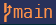

Prior to the Windows Terminal in 2020, people used to either use 'conhost' or 'cmder'; a much better open source alternative. You couldn't do much to the interface.

Now, with Terminal, you can install a piece of software called oh-my-posh. This renders over the terminal and adds a set of emojis (for which there is no glossary but can be figured out by trial and error).

# PowerShell Profile

You will need to import both of the following modules every time you start up by adding them to the PowerShell profile. I have described the process of creating a profile.

> See my PowerShell profile: __[Download](../assets/pwsh.ps1)

```powershell
# Add terminal icons
Import-Module -Name Terminal-Icons

# Add oh-my-posh
oh-my-posh init pwsh --config "$env:USERPROFILE\profiles\bubblesextra.omp.json" | Invoke-Expression
```

You need a PowerShell profile file to start modules start every time and to assign aliases. 

> See my PowerShell profile: __[Download](../assets/pwsh.ps1)


Create the profile file:

```powershell
if (!(Test-Path -Path $PROFILE ))
{ New-Item -Type File -Path $PROFILE -Force }
```

Open the Profile:

```powershell
notepad $profile
```

Copy each `Import-Module` statement into the profile file and save it:

```powershell
Import-Module -Name Terminal-Icons
```

Set-Aliases:

```powershell
Set-Alias -Name g -Value git
```

Set Functions (aliases to which you also want to pass arguments)

```powershell
Function c {git commmit -am $args}
```

Reference the profile file in another location if you want you sync between computers as you may want the main profile file to contain PC-specific information.

```powershell
$profile = "~\profiles\pwsh.ps1"
. $profile

## Add Icons to `ls` standard output

The fastest improvement you can make it to decorate your file-lists with colour and icons.

```powershell
Install-Module -Name Terminal-Icons -Repository PSGallery
Import-Module -Name Terminal-Icons
```

## oh-my-posh

> My oh-my-posh theme file is here: __[Download](../assets/bubblesextra.omp.json)__.

Never install via the 'module' as it is deprecated, but seems to be referenced everywhere. I couldn't install __winget__, so I installed via __scoop__:

```powershell
scoop install https://github.com/JanDeDobbeleer/oh-my-posh/releases/latest/download/oh-my-posh.json
```

Check it works:

```powershell
oh-my-posh init pwsh | Invoke-Expression
```

You should see a more colourful terminal with these placeholder characters: ▯

You have to install a font which can represent all the relevant character with:

```
oh-my-posh font install
```

This didn't work for me, so I had to download the 'nerd' fonts manually from [Nerdfonts.com](https://www.nerdfonts.com/font-downloads). Open the downloaded folder, then right-click on the 'complete' version of any given font of your choosing and install it into windows.
Now you can go into the settings of your PowerShell profile in the terminal and adjust the font to the appropriate one.

### git symbols

[StackOverFlow](https://stackoverflow.com/questions/65602969/understanding-the-git-symbols-in-oh-my-posh)

Symbol | Description
-|-
 | Remote: GitHub / GitLab
 | Branch name
 `≡` | Remote: 'Up to date'
 `↑`  | Remote: Ahead
 `↓` | Remote: Behind
`?` | Worktree: Untracked files
`~` | Worktree: Modified files
`+` |  Index: Staged new files
`~` | Index: Staged Modified files
`?` | Index: Conflicted files


### Edit The Themes

You will very quickly find that the default theme is to cluttered and annoying. Each theme is completely defined by a .json config file. All the emojis are predefined in the oh-my-posh software, so all you themes do is turn features on an off, right or left align and change colours.

You can go into the themes folder and change the theme config json. When you installed the oh-my-posh software, it should have created the environment variable called ''POSH_THEMES_PATH". Mine is at `%userprofile%\scoop\apps\oh-my-posh\current\themes`.

```powershell
oh-my-posh init pwsh --config 
"$env:POSH_THEMES_PATH/bubblesextra.omp.json" | Invoke-Expression
```

> Note, that `%userprofile%\…` is the CMD format path which is in the environment variables in the Windows System Properties Window.  The equivalent Powershell format is  `$env:userprofile\…` or shorthand: `~\…` . CMD and Powershell have different environment variable syntax. `%…%` vs `$env:…`.

Each emoji item in a theme is represented as a 'segment' item in the .json file.  Sadly, there are no images in the [oh my posh website](https://ohmyposh.dev/docs/) so you have to experiment with deleting things and turn on true and false parameters to see what is is what. The git segment is particularly confusing. The actual emoji they render don't correspond to any Unicode code points, so they seem to have created custom svgs, rather than using stock emoji.

There is also two different git segments [git](https://ohmyposh.dev/docs/segments/git) and [poshgit](https://ohmyposh.dev/docs/segments/poshgit). Apparently posh-git is a newer but different implementation, the stock themes don't seem to use it and it is an identical copy, but it just also includes auto-completion. It breaks my oh my posh, so I ignore it. Perhaps you have to install it separately.

I use the `bubblesextra.omp.json` default theme with a few edits.


# Powershell Autocomplete
The best way to improve your efficiency in the command line is to add autocompletion. There are a few different types:

- Tab-completion: press tab and it toggles folder or file suggestions.
- Menu-complete: press Ctrl-Space and it displays either folder-file suggestion or command option in a tabular menu, which you can navigate around with arrow keys.
- Auto-prediction: press the right-arrow and it auto-completes the full command based on either history or autogenerated predictions.

PSReadline provides Menu-complete and auto-prediction. poshgit provides menu-complete for git commands and z provides auto-prediction for folder-paths.

## PowerShell Profile

You will need to import all of these modules every time you start up by adding them to the PowerShell profile. I have described this at in [PowerShell profile](./pwsh-profile).

> See my PowerShell profile: __[Download](../assets/pwsh.ps1)


## Install z Module

`z …` is functionally equivalent to `cd …` but it remembers your recent calls, so you can press tab halfway through to autocomplete. It prioritises autocompletion suggestions via recency and frequency. Z is the most useful module I have.

A quick-start guide is [here](https://www.hanselman.com/blog/spend-less-time-cding-around-directories-with-the-powershell-z-shortcut).

[Here](https://github.com/badmotorfinger/z?WT.mc_id=-blog-scottha) is the source code.

```powershell
Install-Module z -AllowClobber
```

Some additional commands:

```
z -l # list z dirs
z -d # Delete dead path from suggestions
z -x # remove the current directory from the list
```

## poshgit

Poshgit provides:

- Menucomplete for git commands (Ctrl +Space)
- A less pretty Git status summary information than oh-my-posh (Disabled by default if using oh-my-posh).

First install nuget:
```powershell
Install-PackageProvider -Name NuGet
```

Command line didn't work for me , so I installed from [nuget.org](https://www.nuget.org/downloads)

Then install posh-git from nuget:
```powershell
PowerShellGet\Install-Module posh-git -Scope CurrentUser -Force
Import-Module posh-git
```

Instructions at [GitHub](https://github.com/dahlbyk/posh-git)

Now you should be able to menu-complete with git.


## PSReadline

PSReadline provides:

- Autocomplete for PowerShell command (From a Predictor and/or history) (Arrow Keys)
- MenuComplete for PowerShell commands (Ctrl + Space)

First check PowerShell version is 7 or above. Need to download the v7 or later [newest one](https://www.microsoft.com/store/productId/9MZ1SNWT0N5D) from windows store.

```
`$PSVersionTable.PSVersion`
```

Install the module:

```
Install-Module PSReadLine
```

Install the Azure commands prediction plugin separately. This is explained basically nowhere, but I found the commands [here](https://techcommunity.microsoft.com/t5/azure-tools-blog/announcing-general-availability-of-az-tools-predictor/ba-p/3297956).

```powershell
Install-module -name Az.Accounts -Force
Install-module -name Az.Tools.Predictor -Force
Enable-AzPredictor -AllSession
```

I also added the [CompletetionPredictor](https://github.com/PowerShell/CompletionPredictor/) but it didn't seem to add any useful suggestions.

```powershell
Install-Module -Name CompletionPredictor -Repository PSGallery
Import-Module -Name CompletionPredictor
```

I actually leave both of these plugins deactivated as they add 10s to the start-up time.

### Display Options

Now you have installed, you have 2 choices for your suggestions:

1. Choose between history and plugins:

```
Set-PSReadLineOption -PredictionSource HistoryAndPlugin # or History or Plugin or  none
```

2. Choose between Inline suggestions and tabulated suggestions. Press `F2` to change the prediction style.

### PSReadline Useful Resources

- [Predictions](https://jdhitsolutions.com/blog/powershell/8969/powershell-predicting-with-style/)
- [Source Code](https://github.com/PowerShell/PSReadLine)
- [Options](https://docs.microsoft.com/en-us/powershell/module/psreadline/set-psreadlineoption?view=powershell-7.2)


