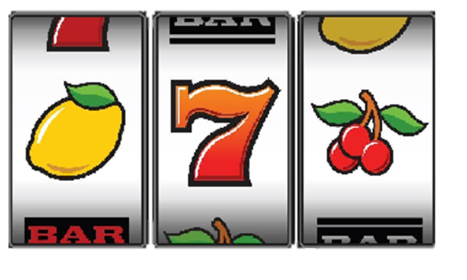
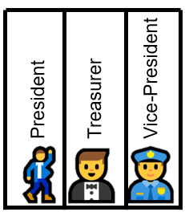
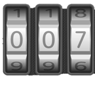
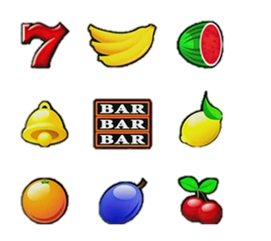

<link rel="stylesheet" href="https://cdn.jsdelivr.net/npm/katex@0.11.1/dist/katex.min.css" integrity="sha384-zB1R0rpPzHqg7Kpt0Aljp8JPLqbXI3bhnPWROx27a9N0Ll6ZP/+DiW/UqRcLbRjq" crossorigin="anonymous">

# Combinatronic  Maths

## The Four Relevant Factors

Four things you need to identify for any combinatorics question:

1. __Combination__ or __Permuation__: Are we counting 'resulting selection' with same items but differently ordered just once (combination) or for each different order (permuations)?
2. __With__ or __Without__ Repetition: Are we selecting from types of objects or individual object instances? I.e. Can we have the same item type appear more than once in a resulting selection?
4. Resulting Selection Size (__𝒓__): the number of instances of item in the resulting selection (a.k.a. the sample size)
3. Number of Object Types (__𝒏__): number of types of the item we are selecting from (a.k.a. the number of objects).

### Combination vs Permutation  

Each combination of 𝒓 items has many ways of arranging the order, known as permutations. Assuming no repetition of object types, there are 𝒓! permutations for each combination. If there is repetition, there is a much more complicated equation for the ratio.

- In a 'combination' the order is irrelevant and we count each time the same item types appears in the resulting selection but ignore combinations with a different order. Each combination has a number of possible permutations, which we ignore. E.g. in a slot machine where 🍇🍍🍊 == 🍍🍇🍊 == 🍍🍊🍇 etc.  Collectively, the 6 possible 'permutations' only represent 1 combination, and we only count the combinations. Another example of a combination is selecting people for a committee.
- In a 'permutation', the order is relevant and we count every order of object types that appears in the resulting selection. E.g. Numbers in a combination lock, or a committee with assigned roles.

### With or Without Repetition

- With Repetitions: Allow and count the repeating object types in the resulting selection. This is when there is a pool of object types rather than actual object instances. E.g. numbers, categories of objects.
- Without repetitions: Don't count or allow repeating objects types in the resulting selection.  This is when there is a pool of individual instances of objects which can only be selected once E.g. physical objects or people.

### Resulting Selection Size (𝒓)

- 𝒓: A Sample a.k.a. 'Resulting selection' ,  contains '𝒓' item instances.

### Number of Object Types (𝒏)

- 𝒏: The pool of objects contains '𝒏' object types.

## The Equations

All combinations (with or without repetition) and permutations (without repetition) are found using some version of the [binomial coefficient equation](https://en.wikipedia.org/wiki/Binomial_coefficient):. This equation, often vocalised as '𝒏 choose 𝒓' or '𝒏 choose 𝒌' is expressed as either: $nCr$ or, $\binom{n}{r}$.
$$\binom{n}{r} = \frac{n!}{r!(n-r)!} $$

-| Combination (𝒓 is Unordered) | Permutation (𝒓 is Ordered)
 -|-|-
Without Repetition (Instances of 𝒏)| [Combination](https://en.wikipedia.org/wiki/Combination#Number_of_k-combinations) $$\binom{n}{r}$$| [Permuation without repetition](https://en.wikipedia.org/wiki/Permutation#Permutations_without_repetitions) $$ r!\binom{n}{r} $$
With Repetition (Types of 𝒏)| [Multiset](https://en.wikipedia.org/wiki/Multiset#Counting_multisets)  $$\binom{n+r-1}{r}$$ | [Permuation with repetition](https://en.wikipedia.org/wiki/Permutation#Permutations_with_repetition)$$ n^r $$

Scientific calculators often have the binomial coefficient function normally written as '$nCr$' or '$\binom{n}{r}$' as above.  The Windows 10 calculator doesn't have this function, so the easiest way for quick calculation is to find an online calculator such as [this](https://www.omnicalculator.com/math/binomial-coefficient).

### Examples

Lets take the examples of a slot machine, committee, role assignment and a combination lock. Each example has a result selection (𝒓) of 3 and 10 object types or instances (𝒏).

Example | Slot machine Combinations | Committee Membership | Role Assignment | Combination Lock Code Permutations
-|-|-|-|-
Combination or Permuation | Combination (Unordered) | Combination (Unordered)|Permutation (Ordered) |Permutation (Ordered)
With or without Repetition | With Repetitions (types) | Without Repetitions (Instances) | Without Repetitions (Instances) |With repetitions (Types)
Equation | [Multiset](https://en.wikipedia.org/wiki/Multiset#Counting_multisets) $$\binom{n+r-1}{r}$$ | [Combination](https://en.wikipedia.org/wiki/Combination#Number_of_k-combinations) $$\binom{n}{r}$$ | [Permuation without repetition](https://en.wikipedia.org/wiki/Permutation#Permutations_without_repetitions)$$ r!\binom{n}{r} $$ | [Permuation with repetition](https://en.wikipedia.org/wiki/Permutation#Permutations_with_repetition) $$ n^r $$
Selection (𝒓) | $$𝒓=3$$ E.g.   |$$𝒓=3$$ E.g.  |$$r=3$$ E.g.    |$$𝒓 = 3$$ E.g.  
Population (𝒏) |  or blank$$𝒏=10$$ | $$𝒏=10$$| $$𝒏=10$$|$$𝒏=10$$
Count |  $$220$$ |  $$120$$| $$720$$ | $$1000$$

## Examples

### See Also

- [libretexts](https://math.libretexts.org/Courses/Monroe_Community_College/MTH_220_Discrete_Math/7%3A_Combinatorics/7.5%3A_Combinations_WITH_Repetitions)
